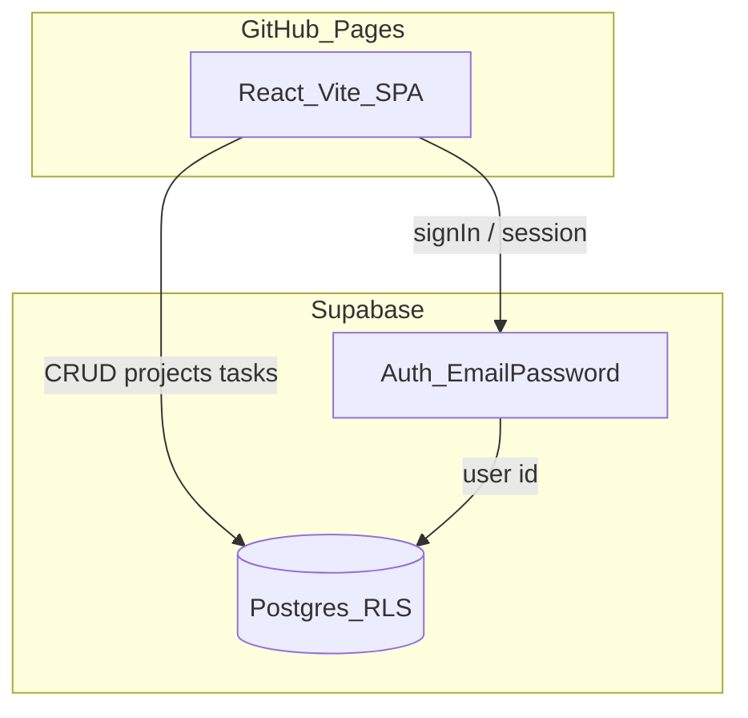

# Architecture

## Stack

- Frontend: React + Vite (SPA), hosted on GitHub Pages
- Backend: Supabase only (Auth email/password + Postgres + RLS)
- No C# API in this phase

## Data flow



## Folder layout

```
.
├── database.json
├── docs/architecture.md
├── scripts/import-users.ps1
├── supabase/migrations/
├── web/                 # React app
└── .github/workflows/
```

## Security notes

- Frontend uses only the anon/publishable key
- Row Level Security enforces who can read/write projects and tasks
- Users are provisioned via admin import script (no public signup in MVP)
